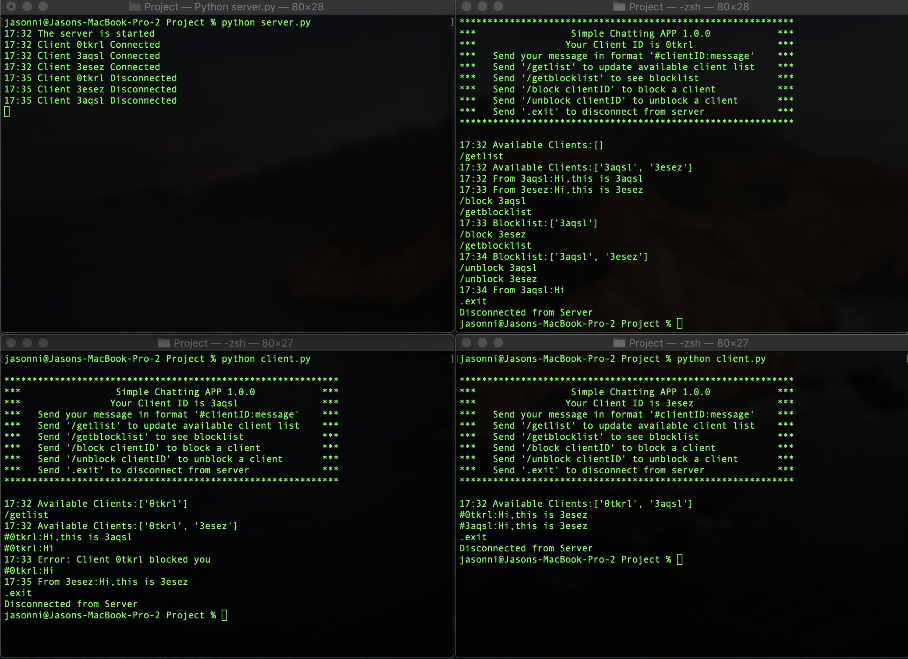

# simple-chat-app

## How to run the program
- Clone the repository
- Make sure your python version is 3
- Open one terminal for server and use `python server.py` to run server
- You should see `The server is started` message in server terminal
- Open one or more terminals for clients and use `python client.py` to run
- You should see `Client Connected` message in server terminal
- Now you are able to chat with other clients

## Functionalities
- Send Message to a Client `#clientID:message`
- Get Current Online Clients List `/getlist`
- Get Blocklist `/getblocklist`
- To Block a Client `/block clientID`
- To Unblock a Client `/unblock clientID`
- Disconnect from Server `.exit`

## Screenshot
- 
